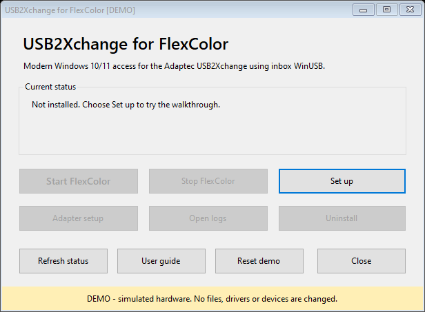
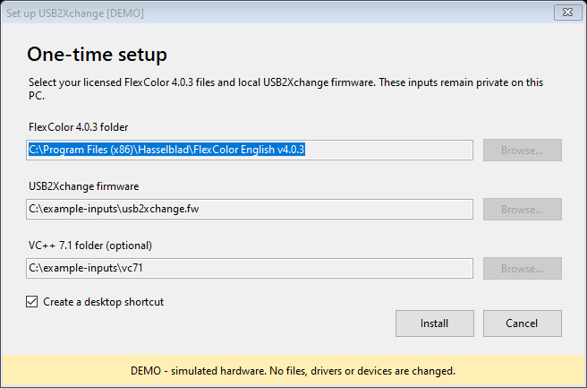
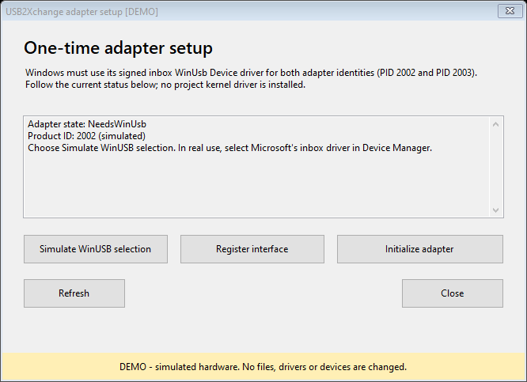
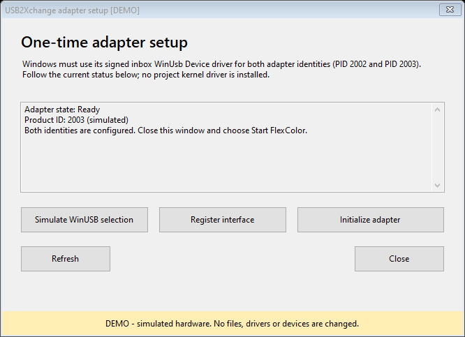
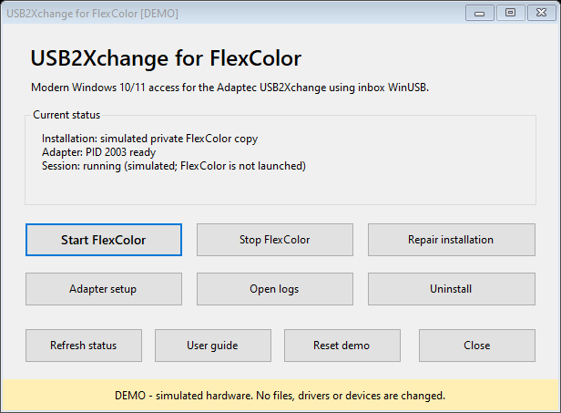

<!-- Copyright (c) 2026 fcusb contributors; SPDX-License-Identifier: GPL-3.0-only -->
# USB2Xchange for FlexColor: illustrated user guide

**Start with the demo if you want to explore without connecting a scanner.**
The manager can rehearse setup, adapter initialization and starting/stopping a
session without FlexColor, firmware, administrator rights or USB hardware.

**Experimental software — use at your own risk.** Real operation can cause
failed scans, data loss, device malfunction or hardware damage. No warranty,
recovery or individual support is promised. Read [DISCLAIMER](../DISCLAIMER.md).

## 1. Download and open

Open the [v0.1.0-poc.1 download page](https://github.com/aidanc/fcusb/releases/tag/v0.1.0-poc.1).
Expand **Assets** if GitHub collapses the list. You do not need to build from
source to try this release.

| Download | Use it for |
| --- | --- |
| `USB2Xchange-Setup-<commit>.exe` | Easiest way to open the setup manager. It extracts the same project files as the runtime ZIP. |
| `usb2xchange-runtime-<commit>.zip` | Inspectable package. Extract **all** files, open the extracted folder, then run `USB2Xchange.exe`. Keep its subfolders together. |
| `usb2xchange-source-<commit>.zip` | Developers who want to inspect or rebuild the exact source. This is not the ready-to-run application. |
| `*.sha256.txt` | Expected SHA-256 values and the full source commit for the adjacent assets. |

The `<commit>` suffix identifies the build, not another file you must download.
Choose either setup or runtime ZIP. Both are unsigned community builds.
Before opening a download, compare its hash with the release manifest:

```powershell
Get-FileHash -Algorithm SHA256 .\USB2Xchange-Setup-<commit>.exe
```

Use the actual filename. Check that the entire hash matches. An unsigned or
unknown-publisher warning is expected; decide whether you trust the reviewed
source and release. Do not globally disable Windows protections. See
[Installation](INSTALLATION.md) for signature inspection and package checks.

## 2. Try it with no hardware

In the extracted runtime folder, double-click **Try demo.cmd**. Alternatively,
open the manager and choose **Try demo**. A separate window opens with **[DEMO]**
in its title and a yellow banner. From a terminal the equivalent is:

```powershell
.\USB2Xchange.exe --demo
```



These pictures are exports of the actual Windows Forms application in demo
mode, using its own rendering. They are not drawings of a proposed interface
or evidence of connected hardware. Every example path and adapter state is
simulated. Windows themes and scaling may look different on your PC.

1. Choose **Set up**. Example paths are already filled in; the demo does not read them.
2. Choose **Install**, then dismiss the success message. No files or shortcuts are installed.
3. Open **Adapter setup**. Choose **Simulate WinUSB selection**, then **Register interface**.
4. Choose **Initialize adapter**. The simulated device changes from PID 2002 to PID 2003.
5. Choose **Simulate WinUSB selection** and **Register interface** again for PID 2003.
6. Close Adapter setup. Choose **Start FlexColor**. The manager reports a simulated session; no FlexColor process opens.
7. Try **Stop FlexColor**, **Repair installation** or **Open logs**. They return simulated results. **Reset demo** starts over.

Closing the demo discards its state. Demo **Uninstall** resets its memory and
closes it; it cannot remove a real installation. To work with real equipment,
close the demo and open the normal manager. The demo never switches to live
hardware in the same process.

This rehearses the **manager workflow**, not the FlexColor scanning interface.
It does not simulate preview images, scan quality, SCSI timing, firmware
transfers, UAC or Windows driver installation. Existing offline protocol/ASPI
tests cover separate logic. Real scanner acceptance remains necessary.

## 3. Prepare for real setup

Use Windows 10 or 11 **x64**, Windows PowerShell 5.1 and .NET Framework 4.8.
Read [Windows prerequisites](WINDOWS_10_11_SETUP.md). The supported combination
is English FlexColor **4.0.3**, Adaptec **USB2Xchange** and FlexTight **Precision II**
at SCSI target **5**, LUN **0**. Other versions and adapters are not qualified.

Before you start, gather these separately licensed inputs:

| Input | Where it belongs in setup |
| --- | --- |
| Complete English FlexColor 4.0.3 folder, including its `Firmware` folder | **FlexColor 4.0.3 folder** |
| Exact `usb2xchange.fw` adapter image | **USB2Xchange firmware** |
| Exact x86 VC++ 7.1 DLLs, if absent from the supported automatic locations | **VC++ 7.1 folder (optional)** |

None of those proprietary files are in the release. Follow
[required files and exact hashes](REQUIRED_EXTERNAL_FILES.md) for acquisition,
validation and the local adapter-firmware extractor. A modern VC++ runtime
is not a replacement for the exact legacy DLLs. Do not run the old Adaptec
installer or install its XP driver.

Keep the scanner off during preparation. Have a VM snapshot or another tested
rollback method before changing a device's driver selection.

## 4. Set up the private application copy

Open the **normal** manager (no demo banner), then choose **Set up**.



In real mode, use **Browse...** to select your own verified files. The VC++ field
may be left empty when the required exact DLLs are already in the FlexColor
source root or `%WINDIR%\SysWOW64`; otherwise select their containing folder.
Choose whether to create a desktop shortcut, then **Install**.

Setup validates the package and inputs, creates a private FlexColor copy under
`%LOCALAPPDATA%\USB2Xchange`, and patches that copy. Your original licensed
installation stays the source for repairs. If asked, open the installed manager.
Use its **USB2Xchange Manager** and **FlexColor with USB2Xchange** shortcuts for
later sessions. The per-user application setup does not require elevation.

If setup rejects a file, check its exact version, size and hash. Do not rename
another version to satisfy a filename. The [troubleshooting guide](TROUBLESHOOTING.md)
explains common prerequisite and package errors.

## 5. Configure the adapter's two identities

Connect only the intended USB2Xchange. Open **Adapter setup** in the manager.
The adapter first appears as a firmware loader (**PID 2002**), then as an
operational device (**PID 2003**). Windows must remember WinUSB for both.



In real mode, the left button reads **Open Device Manager**. The demo-only
**Simulate WinUSB selection** button never appears in normal operation.

1. In Device Manager, open the adapter's **Properties → Details → Hardware Ids**.
   Verify `USB\VID_03F3&PID_2002` before changing anything. A new device may be
   under Other devices with Code 28.
2. Choose **Update driver → Browse my computer → Let me pick → Universal Serial
   Bus devices → WinUsb Device**, using Microsoft's signed inbox driver.
3. Back in the manager, choose **Refresh**. `NeedsInterfaceRegistration` means
   the driver is selected but the project interface GUID is still missing.
4. Choose **Register interface**. Read the first-use experimental risk warning;
   it defaults to No. If you choose to proceed, this real action requests UAC
   elevation to register only the present adapter's interface and restart it.
5. At `Ready`, PID 2002, choose **Initialize adapter**. This loads the supplied
   adapter firmware and waits for re-enumeration as PID 2003.
6. First-time initialization can time out while the new PID is unbound. Check
   Hardware Ids again, then repeat WinUSB selection and **Register interface**
   for `USB\VID_03F3&PID_2003`.



You are finished when PID 2003 is `Ready`. Close Adapter setup. Full details,
the interface GUID and reconnect notes are in [WinUSB setup](USB2XCHANGE_WINUSB_SETUP.md).
No project kernel driver, test-signing, root certificate or Secure Boot change
is needed for this path. Do not select a different device just because its
name looks similar.

## 6. Start, scan and stop

Follow the scanner manual for safe SCSI cabling, termination, holder loading and
power sequence. Set the supported scanner to target 5/LUN 0. Once connected
and powered correctly, choose **Start FlexColor** or use **FlexColor with
USB2Xchange**. Subsequent starts handle normal adapter firmware initialization.



In real operation Start checks the scanner identity and launches the prepared
private FlexColor process. Exact expected identities are `Imacon / SCSI Loader /
L302` or `Imacon / FlexTight II / M333`. FlexColor normally performs the scanner
microcode initialization itself.

Within the real FlexColor application, choose your holder and settings, run
**Preview**, then **Scan**, and save outside the installation to a backed-up
folder. Check saved dimensions, depth and appearance. The guide deliberately
does not portray a simulated scan as successful hardware operation.

To cancel a scan, use **Stop inside FlexColor** and allow cleanup to finish.
The manager's **Stop FlexColor** closes its managed application session; it is
not the scan-cancel button. Avoid USB/SCSI disconnects during operation. See
[daily use](DAILY_USE.md) for output checks and sharpening notes.

## 7. When something needs attention

| What you see | What to do next |
| --- | --- |
| Not installed / Start disabled | Choose Set up with the exact licensed inputs. |
| Disconnected | Check adapter USB connection; choose Refresh. |
| Multiple / ambiguous adapters | Leave only the intended adapter connected before proceeding. |
| NeedsWinUsb | Verify that PID in Device Manager, then select the inbox WinUSB driver. |
| NeedsInterfaceRegistration | Choose Register interface for the currently present PID. |
| PID 2002 Ready | Initialize adapter, then configure PID 2003 if this is first setup. |
| PID 2003 Ready, but Start fails | Check scanner power, SCSI termination/target 5 and the exact error. Avoid repeated blind retries. |
| Missing files or hash mismatch | Check versions and source files; use Repair installation only after correcting the prerequisite. |

**Open logs** opens the private `Usb2XchangeLogs` folder in real mode. Review and
redact paths/device identifiers before sharing a small relevant excerpt. Do not
upload proprietary files, firmware, full logs or personal scans.

**Repair installation** verifies and rebuilds the private copy from the
configured sources. **Uninstall** removes this user's private copy, settings
and shortcuts; it leaves the Microsoft WinUSB selection in place. Close
FlexColor first and keep scans outside the install tree. Read
[uninstall and rollback](UNINSTALL.md) before removal.

For unresolved problems use [Troubleshooting](TROUBLESHOOTING.md), then the
[issue templates](https://github.com/aidanc/fcusb/issues/new/choose).
Report the release, Windows version, exact error and whether you were in demo
or real mode. Read [known limitations](KNOWN_LIMITATIONS.md): the updated GUI
workflow still needs complete clean-VM/hardware qualification. Demo success
does not change that boundary.
